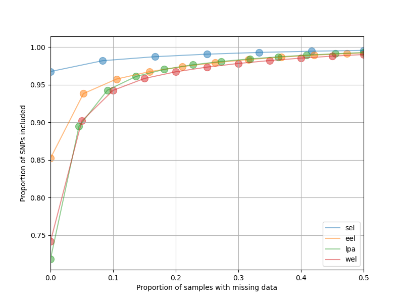

## Variant Filtering

The variants contained in the VCF file were filtered following these criteria:

  1. Variants from repetitive and low complexity regions
  2. Indels and non-biallelic variants
  3. Substitutions from reference species (non variant SNPs with AF=1)
  4. Variant quality filters, as GATK standard practices
  5. Depth $$
  6. Missing Data $$

----

### Find repetitive and low complexity regions

To identify repeats and low complexity regions of the genome we used both [RepeatModeler](https://www.repeatmasker.org/RepeatModeler/) and [RepeatMasker](https://www.repeatmasker.org/RepeatMasker/).

Repeats were identified and annotated by the people at CNAG when creating the reference genome using RepeatModeler. These are saved in the file `Repeats.4jb.gff3.gz`.

Low complexity regions of the genome were identified using RepeatMasker using the [mask_repeats](src/variant_filtering/mask_repeats.sh) script.
```
ref=/mnt/lustre/hsm/nlsas/notape/home/csic/ebd/jgl/reference_genomes/lynx_rufus_mLynRuf2.2/mLynRuf2.2.revcomp.scaffolds.fa

sbatch \
    --job-name=repeatmasker \
    --output=logs/variant_filtering/repeatmasker.out \
    --error=logs/variant_filtering/repeatmasker.err \
    src/variant_filtering/mask_repeats.sh ${ref}
```

This command generates the file `mLynRuf2.2.revcomp.scaffolds.fa.out.gff` which contains coordinates for low complexity regions.

To join the repeats with the low complexity regions:
```
ref_dir=/mnt/lustre/hsm/nlsas/notape/home/csic/ebd/jgl/reference_genomes/lynx_rufus_mLynRuf2.2

cat <(grep -v "#" ${ref_dir}/Repeats.4jb.gff3 | awk -F'\t' '{OFS="\t"; print $1, $4-1, $5}') \
    <(grep -v "#" ${ref_dir}/repeatmasker/mLynRuf2.2.revcomp.scaffolds.fa.out.gff | awk -F'\t' '{OFS="\t"; print $1, $4-1, $5}') |
    sort -k 1,1 -k2,2n -k3,3n |
    bedtools merge -i - \
    > ${ref_dir}/repeats_lowcomplexity_regions.bed
```

To calculate the length of these regions I run:
`awk '{sum+=$3-$2} END {print sum}' ${ref_dir}/repeats_lowcomplexity_regions.bed`

The result is 1_037_211_281, which is ~43% of the total genome (2_420_127_838).

----

### Applying filters 1 to 4

To apply the filters 1 to 4 I use the [apply_filters_1to4_invcf_ref_maskbed](src/variant_filtering/apply_filters_1to4_invcf_ref_maskbed.sh) script. This script applies a combination of [bedtools](https://bedtools.readthedocs.io/en/latest/), [gatk](https://gatk.broadinstitute.org/hc/en-us) and [bcftools](https://samtools.github.io/bcftools/bcftools.html) to remove:

  1. Variants from repetitive and low complexity regions
  2. Indels and non-biallelic variants
  3. Substitutions from reference species (non variant SNPs with AF=1)
  4. Variant quality filters, as GATK standard practices

As the only variation from [GATK standard practices](https://gatk.broadinstitute.org/hc/en-us/articles/360035890471-Hard-filtering-germline-short-variants) regarding hard-quality filters, I'm going to filter out any variant with a QD < 6 instead of the reccomened 2, as I noticed (by *a posteriori* investigating individual variants) low quality unreliable variants would not be filtered out.

```
vcf_dir=/mnt/lustre/hsm/nlsas/notape/home/csic/ebd/jgl/lynx_genome/lynx_data/mLynRuf2.2_ref_vcfs
invcf=${vcf_dir}/lynxtrogression_v2.autosomic_scaffolds.vcf.gz
ref_dir=/mnt/lustre/hsm/nlsas/notape/home/csic/ebd/jgl/reference_genomes/lynx_rufus_mLynRuf2.2
ref=${ref_dir}/mLynRuf2.2.revcomp.scaffolds.fa
maskbed=${ref_dir}/repeats_lowcomplexity_regions.bed

sbatch \
    --job-name=filter1to4 \
    --output=logs/variant_filtering/filter1to4.out \
    --error=logs/variant_filtering/filter1to4.err \
    src/variant_filtering/apply_filters_1to4_invcf_ref_maskbed.sh \
    ${invcf} ${ref} ${maskbed}
```

To count the number of variants left at each step:
```
vcf_dir=/mnt/lustre/hsm/nlsas/notape/home/csic/ebd/jgl/lynx_genome/lynx_data/mLynRuf2.2_ref_vcfs

# starting vars:
zgrep -v "#" ${vcf_dir}/lynxtrogression_v2.autosomic_scaffolds.vcf.gz | wc -l
# 33660503

# after removing repetitive and low complexity regions:
grep -v "#" ${vcf_dir}/lynxtrogression_v2.autosomic_scaffolds.filter1.vcf | wc -l
# 16708960

# after removing indels and non-biallelic variants:
grep -v "#" ${vcf_dir}/lynxtrogression_v2.autosomic_scaffolds.filter2.vcf | wc -l
# 13196733

# after removing substitutions from reference species:
grep -v "#" ${vcf_dir}/lynxtrogression_v2.autosomic_scaffolds.filter3.vcf | wc -l
# 7131855

# after removing variants based on quality:
grep -v "#" ${vcf_dir}/lynxtrogression_v2.autosomic_scaffolds.filter4.vcf | wc -l
# 6937652 = 0.9727696371 of SNPs remain after this step
```

----

### Divide the VCF by population

The next filters are applied based on population so I will divide the filter4 vcf file into four population vcfs: `lpa`, `wel`, `eel` and `sel`.

I use gatk to do it:

```
ref_dir=/mnt/lustre/hsm/nlsas/notape/home/csic/ebd/jgl/reference_genomes/lynx_rufus_mLynRuf2.2
ref=${ref_dir}/mLynRuf2.2.revcomp.scaffolds.fa
vcf_dir=/mnt/lustre/hsm/nlsas/notape/home/csic/ebd/jgl/lynx_genome/lynx_data/mLynRuf2.2_ref_vcfs
invcf=${vcf_dir}/lynxtrogression_v2.autosomic_scaffolds.filter4.vcf

for pop in lpa wel eel sel; do
    if [ ${pop} == "lpa" ]; then
        samples=($(grep "lp_sm" data/sample.list))
    elif [ ${pop} == "wel" ]; then
        samples=($(grep -E "ll_ki|ll_ur" data/sample.list))
    elif [ ${pop} == "eel" ]; then
        samples=($(grep -E "ll_ya|ll_vl" data/sample.list))
    elif [ ${pop} == "sel" ]; then
        samples=($(grep -E "ll_ca" data/sample.list))
    fi
    echo "-- creating vcf of ${pop} --"
    gatk SelectVariants \
        -R ${ref} \
        -V ${invcf} \
        $(for sample in ${samples[@]}; do echo "-sn ${sample}";done) \
        -O ${invcf/.vcf/.${pop}_pop.vcf}
done
```

----

### Calculate missing data filters per population

To filter out excessively missing variants in each population I calculate missing data separately in each vcf.

The number of missing genotype is calculated for each SNP in the population vcfs by comparing the number of samples to the number of genotyped allels (AN = third field of the INFO column) as follows:
```
vcf_dir=/mnt/lustre/hsm/nlsas/notape/home/csic/ebd/jgl/lynx_genome/lynx_data/mLynRuf2.2_ref_vcfs
for pop in lpa wel eel sel; do
    if [ ${pop} == "lpa" ]; then
        nsamples=$(grep "lp_sm" data/sample.list | wc -l)
    elif [ ${pop} == "wel" ]; then
        nsamples=$(grep -E "ll_ki|ll_ur" data/sample.list | wc -l)
    elif [ ${pop} == "eel" ]; then
        nsamples=$(grep -E "ll_ya|ll_vl" data/sample.list | wc -l)
    elif [ ${pop} == "sel" ]; then
        nsamples=$(grep -E "ll_ca" data/sample.list | wc -l)
    fi
    echo "-- calculating missing genotypes of ${pop} : N=${nsamples} --"
    vcf=${vcf_dir}/lynxtrogression_v2.autosomic_scaffolds.filter4.${pop}_pop.vcf
    paste <(grep -v "#" ${vcf} | cut -f1,2) \
        <(grep -v "#" $vcf | cut -f8 | cut -d';' -f3 | cut -d'=' -f2 | awk -v nsam="${nsamples}" '{print ((nsam*2)-$1)/2}') | 
        awk '{print $1, $2-1, $2, $3}' | tr ' ' '\t' \
        > data/variant_filtering/missing/${pop}.nmiss.bed
done
```

From these bed files I can calculate if a particular SNP should be filtered out or not for a population using the [make_missfilter_beds](src/variant_filtering/make_missfilter_beds.py) script. SNPs with a number of missing genotypes that exceeds the 20% of samples of a particular population are selected for removal and their coordinates are stored in a bed file for each population. Additionally the scripts prints the following summary:
```
sel: 66331 SNPs have more than 20% (>3 samples) missing genotypes (99.044% of total SNPs)
eel: 180494 SNPs have more than 20% (>4 samples) missing genotypes (97.398% of total SNPs)
lpa: 164083 SNPs have more than 20% (>5 samples) missing genotypes (97.635% of total SNPs)
wel: 185354 SNPs have more than 20% (>5 samples) missing genotypes (97.328% of total SNPs)
```
and draws this plot:



----

### Calculate read depth filters in 10k bp window

To avoid including in the analysis possible paralogs whose SNP profiles do not reflect real genetic diversity we eliminate genomic regions where an excess of sequencing reads align to the reference genome.

Mean read depth in consecutive 10kbp windows along the genome was calculated using the software [mosdepth v0.3.2](https://github.com/brentp/mosdepth) from each sample's BAM using the [sbatch_mosdepth_10k_bam_outdir](src/variant_filtering/sbatch_mosdepth_10k_bam_outdir.sh) script:
```
inbams=($(cat data/bamlists/lp_ll_introgression.bamlist))

for bam in ${inbams[*]}; do
    echo "calculating depth of $bam"
    sbatch src/variant_filtering/sbatch_mosdepth_10k_bam_outdir.sh \
        ${bam} \
        data/variant_filtering/depth
done
```

From these results, I can calculate if a particular window should be filtered or not for a population using the [make_rdfilter_beds](src/variant_filtering/make_rdfilter_beds.py) scripts. Windows whose the sum of depth values for the population exceeds 1.5 times the mode of values are marked as failed for that population in the [regions_depth_filtering.tsv](data/variant_filtering/depth/regions_depth_filtering.tsv) table. The script also outputs one bed file for each population containing the coordinates for the windows that do not pass the filter, prints the following summary:
```
sel fail: 1050
wel fail: 873
eel fail: 1006
lpa fail: 1202
all fail: 714
lpa fail and others pass: 275
```
and these plots:

<table>
    <tr>
        <td></td>
        <td></td>
        <td></td>
        <td></td>
    </tr>
</table>

### Create Population-Pair vcfs and apply population filters

My analyses will be run on vcfs that include samples of Iberian lynx (lpa) paired with samples from one of the Eurasian lynx populations (wel, eel, sel). This means a total of 3 distinct vcfs of the three population pairs: `lpa-wel`, `lpa-eel` and `lpa-sel`. To generate these vcfs from the vcf with all of the samples I use gatk:
```
ref_dir=/mnt/lustre/hsm/nlsas/notape/home/csic/ebd/jgl/reference_genomes/lynx_rufus_mLynRuf2.2
ref=${ref_dir}/mLynRuf2.2.revcomp.scaffolds.fa
vcf_dir=/mnt/lustre/hsm/nlsas/notape/home/csic/ebd/jgl/lynx_genome/lynx_data/mLynRuf2.2_ref_vcfs
invcf=${vcf_dir}/lynxtrogression_v2.autosomic_scaffolds.filter4.vcf

for pop in wel eel sel; do
    if [ ${pop} == "wel" ]; then
        samples=($(grep -E "lp_sm|ll_ki|ll_ur" data/sample.list))
    elif [ ${pop} == "eel" ]; then
        samples=($(grep -E "lp_sm|ll_ya|ll_vl" data/sample.list))
    elif [ ${pop} == "sel" ]; then
        samples=($(grep -E "lp_sm|ll_ca" data/sample.list))
    fi
    echo "-- creating vcf of lpa-${pop} --"
    gatk SelectVariants \
        -R ${ref} \
        -V ${invcf} \
        $(for sample in ${samples[@]}; do echo "-sn ${sample}";done) \
        -O ${invcf/.vcf/.lpa-${pop}_pair.vcf}
done
```

To remove high depth windows and high missing SNPs from these vcfs I use bedtools:
```
vcf_dir=/mnt/lustre/hsm/nlsas/notape/home/csic/ebd/jgl/lynx_genome/lynx_data/mLynRuf2.2_ref_vcfs

for pop in wel eel sel; do
    # apply the filter based on missingness
    echo "filtering lpa-${pop} vcf removing SNPs with an excess of missing data"
    bedtools subtract -header \
        -a ${vcf_dir}/lynxtrogression_v2.autosomic_scaffolds.filter4.lpa-${pop}_pair.vcf \
        -b data/variant_filtering/missing/lpa.miss_filter.bed |
    bedtools subtract -header \
        -a stdin \
        -b data/variant_filtering/missing/${pop}.miss_filter.bed \
    > ${vcf_dir}/lynxtrogression_v2.autosomic_scaffolds.filter4.lpa-${pop}_pair.miss_fil.vcf

    # apply the filter based on read depth
    echo "filtering lpa-${pop} vcf removing windows with an excess of read depth"
    bedtools subtract -header \
        -a ${vcf_dir}/lynxtrogression_v2.autosomic_scaffolds.filter4.lpa-${pop}_pair.miss_fil.vcf \
        -b data/variant_filtering/depth/lpa.rd_filter.bed |
    bedtools subtract -header \
        -a stdin \
        -b data/variant_filtering/depth/${pop}.rd_filter.bed \
    > ${vcf_dir}/lynxtrogression_v2.autosomic_scaffolds.filter4.lpa-${pop}_pair.miss_fil.rd_fil.vcf
done
```
