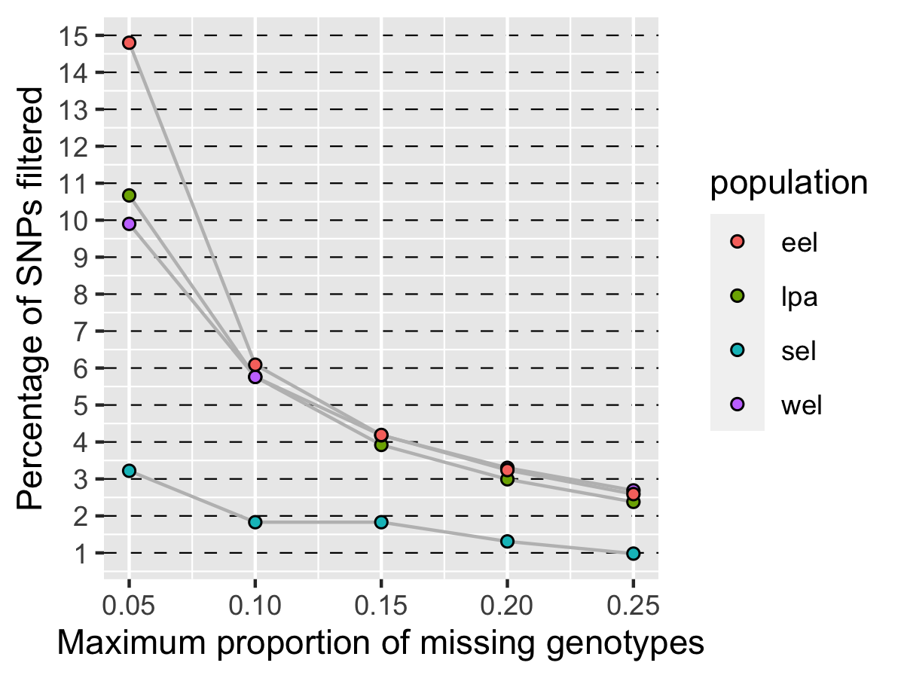
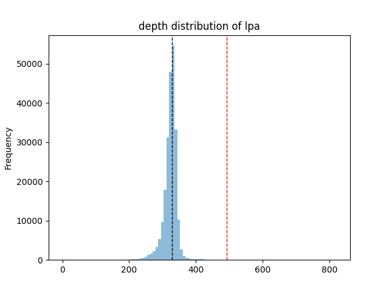
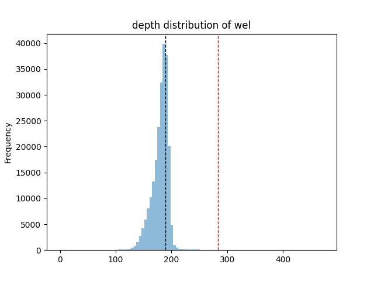
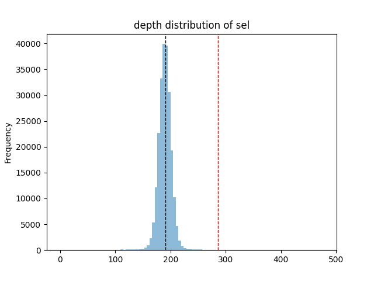

## Variant Filtering

The variants contained in the VCF file were filtered following these criteria:

  1. Variants from repetitive and low complexity regions
  2. Indels and non-biallelic variants
  3. Substitutions from reference species (non variant SNPs with AF=1)
  4. Variant quality filters, as GATK standard practices
  5. Depth $$
  6. Missing Data $$

----

### Find repetitive and low complexity regions

To identify repeats and low complexity regions of the genome we used both [RepeatModeler](https://www.repeatmasker.org/RepeatModeler/) and [RepeatMasker](https://www.repeatmasker.org/RepeatMasker/).

Repeats were identified and annotated by the people at CNAG when creating the reference genome using RepeatModeler. These are saved in the file `Repeats.4jb.gff3.gz`.

Low complexity regions of the genome were identified using RepeatMasker using the [mask_repeats](src/variant_filtering/mask_repeats.sh) script.
```
ref=/mnt/lustre/hsm/nlsas/notape/home/csic/ebd/jgl/reference_genomes/lynx_rufus_mLynRuf2.2/mLynRuf2.2.revcomp.scaffolds.fa

sbatch \
    --job-name=repeatmasker \
    --output=logs/variant_filtering/repeatmasker.out \
    --error=logs/variant_filtering/repeatmasker.err \
    src/variant_filtering/mask_repeats.sh ${ref}
```

This command generates the file `mLynRuf2.2.revcomp.scaffolds.fa.out.gff` which contains coordinates for low complexity regions.

To join the repeats with the low complexity regions:
```
ref_dir=/mnt/lustre/hsm/nlsas/notape/home/csic/ebd/jgl/reference_genomes/lynx_rufus_mLynRuf2.2

cat <(grep -v "#" ${ref_dir}/Repeats.4jb.gff3 | awk -F'\t' '{OFS="\t"; print $1, $4-1, $5}') \
    <(grep -v "#" ${ref_dir}/repeatmasker/mLynRuf2.2.revcomp.scaffolds.fa.out.gff | awk -F'\t' '{OFS="\t"; print $1, $4-1, $5}') |
    sort -k1,1 -k2,2n -k3,3n |
    bedtools merge -i - \
    > ${ref_dir}/repeats_lowcomplexity_regions.bed
```

To calculate the length of these regions I run:
`awk '{sum+=$3-$2} END {print sum}' ${ref_dir}/repeats_lowcomplexity_regions.bed`

The result is 1_037_211_281, which is ~43% of the total genome (2_420_127_838).

----

### Applying filters 1 to 4

To apply the filters 1 to 4 I use the [apply_filters_1to4_invcf_ref_maskbed](src/variant_filtering/apply_filters_1to4_invcf_ref_maskbed.sh) script. This script applies a combination of [bedtools](https://bedtools.readthedocs.io/en/latest/), [gatk](https://gatk.broadinstitute.org/hc/en-us) and [bcftools](https://samtools.github.io/bcftools/bcftools.html) to remove:

  1. Variants from repetitive and low complexity regions
  2. Indels and non-biallelic variants
  3. Substitutions from reference species (non variant SNPs with AF=1)
  4. Variant quality filters, as GATK standard practices

As the only variation from [GATK standard practices](https://gatk.broadinstitute.org/hc/en-us/articles/360035890471-Hard-filtering-germline-short-variants) regarding hard-quality filters, I'm going to filter out any variant with a QD < 6 instead of the reccomened 2, as I noticed (by *a posteriori* investigating individual variants) low quality unreliable variants would not be filtered out.

```
vcf_dir=/mnt/lustre/hsm/nlsas/notape/home/csic/ebd/jgl/lynx_genome/lynx_data/mLynRuf2.2_ref_vcfs
invcf=${vcf_dir}/lynxtrogression_v2.autosomic_scaffolds.vcf.gz
ref_dir=/mnt/lustre/hsm/nlsas/notape/home/csic/ebd/jgl/reference_genomes/lynx_rufus_mLynRuf2.2
ref=${ref_dir}/mLynRuf2.2.revcomp.scaffolds.fa
maskbed=${ref_dir}/repeats_lowcomplexity_regions.bed

sbatch \
    --job-name=filter1to4 \
    --output=logs/variant_filtering/filter1to4.out \
    --error=logs/variant_filtering/filter1to4.err \
    src/variant_filtering/apply_filters_1to4_invcf_ref_maskbed.sh \
    ${invcf} ${ref} ${maskbed}
```

To count the number of variants left at each step:
```
vcf_dir=/mnt/lustre/hsm/nlsas/notape/home/csic/ebd/jgl/lynx_genome/lynx_data/mLynRuf2.2_ref_vcfs

# starting vars:
zgrep -v "#" ${vcf_dir}/lynxtrogression_v2.autosomic_scaffolds.vcf.gz | wc -l
# 33660503

# after removing repetitive and low complexity regions:
grep -v "#" ${vcf_dir}/lynxtrogression_v2.autosomic_scaffolds.filter1.vcf | wc -l
# 16708960

# after removing indels and non-biallelic variants:
grep -v "#" ${vcf_dir}/lynxtrogression_v2.autosomic_scaffolds.filter2.vcf | wc -l
# 13196733

# after removing substitutions from reference species:
grep -v "#" ${vcf_dir}/lynxtrogression_v2.autosomic_scaffolds.filter3.vcf | wc -l
# 7131855

# after removing variants based on quality:
grep -v "#" ${vcf_dir}/lynxtrogression_v2.autosomic_scaffolds.filter4.vcf | wc -l
# 6495225 = 0.910734304 of SNPs remain after this step
```

----

### Divide the VCF by population

The next filters are applied based on population so I will divide the filter4 vcf file into four population vcfs: `lpa`, `wel`, `eel` and `sel`.

I use gatk to do it:

```
ref_dir=/mnt/lustre/hsm/nlsas/notape/home/csic/ebd/jgl/reference_genomes/lynx_rufus_mLynRuf2.2
ref=${ref_dir}/mLynRuf2.2.revcomp.scaffolds.fa
vcf_dir=/mnt/lustre/hsm/nlsas/notape/home/csic/ebd/jgl/lynx_genome/lynx_data/mLynRuf2.2_ref_vcfs
invcf=${vcf_dir}/lynxtrogression_v2.autosomic_scaffolds.filter4.vcf

for pop in lpa wel eel sel; do
    if [ ${pop} == "lpa" ]; then
        samples=($(grep "lp_sm" data/sample.list))
    elif [ ${pop} == "wel" ]; then
        samples=($(grep -E "ll_ki|ll_ur" data/sample.list))
    elif [ ${pop} == "eel" ]; then
        samples=($(grep -E "ll_ya|ll_vl" data/sample.list))
    elif [ ${pop} == "sel" ]; then
        samples=($(grep -E "ll_ca" data/sample.list))
    fi
    echo "-- creating vcf of ${pop} --"
    gatk SelectVariants \
        -R ${ref} \
        -V ${invcf} \
        $(for sample in ${samples[@]}; do echo "-sn ${sample}";done) \
        -O ${invcf/.vcf/.${pop}_pop.vcf}
done
```

----

### Calculate missing data filters per population

To filter out excessively missing variants in each population I calculate missing data separately in each vcf.

I use `bcftools filter` to generate BED files which contain the SNPs that would be excluded with different thresholds of maximum proportion of missing data (from 0.05 to 0.25 in 0.05 increments).

I also output a table to easily plot the results in R and a summary of the filtering:

```
vcf_dir=/mnt/lustre/hsm/nlsas/notape/home/csic/ebd/jgl/lynx_genome/lynx_data/mLynRuf2.2_ref_vcfs

# total number of SNPs is the same in each population
n_tot=$(grep -v "#" ${vcf_dir}/lynxtrogression_v2.autosomic_scaffolds.filter4.vcf | wc -l)

# create a table for plotting
echo "population n_tot f_miss n_filter" > data/variant_filtering/missing/miss_table.txt

for pop in lpa wel eel sel; do
    vcf=${vcf_dir}/lynxtrogression_v2.autosomic_scaffolds.filter4.${pop}_pop.vcf
    # work with different proportions of missing data
    for f_miss in 0.05 0.1 0.15 0.2 0.25; do
        echo "extracting SNPs in ${pop} with F_MISSING > ${f_miss}"

        ## to extract the bed files:
        # change f_miss string for better file name
        f_miss_x=$(echo $f_miss | tr '.' '_')
        # extract bed of SNPs with more missing data than proportion defined by f_miss
        bcftools filter -i "F_MISSING > ${f_miss}" ${vcf} | grep -v "#" | awk '{print $1, $2-1, $2}' | tr ' ' '\t' \
            > data/variant_filtering/missing/${pop}.f_miss.${f_miss_x}.bed
        
        ## to fill the table for plotting:
        # count the number of SNPs that have more missing data than proportion
        nfilter=$(cat data/variant_filtering/missing/${pop}.f_miss.${f_miss_x}.bed | wc -l)
        # add a row to table for plotting
        echo "${pop} ${n_tot} ${f_miss} ${nfilter}" >> data/variant_filtering/missing/miss_table.txt
        
        ## to print a summary:
        if [ ${pop} == "lpa" ]; then
            nsamples=$(grep "lp_sm" data/sample.list | wc -l)
        elif [ ${pop} == "wel" ]; then
            nsamples=$(grep -E "ll_ki|ll_ur" data/sample.list | wc -l)
        elif [ ${pop} == "eel" ]; then
            nsamples=$(grep -E "ll_ya|ll_vl" data/sample.list | wc -l)
        elif [ ${pop} == "sel" ]; then
            nsamples=$(grep -E "ll_ca" data/sample.list | wc -l)
        fi
        n_miss=$(echo "${nsamples} * ${f_miss}" | bc -l)
        pleft=$(echo "${nfilter} / ${n_tot} * 100" | bc -l | cut -c1-5)
        echo "${pop}: ${nfilter} SNPs have a proportion of missing genotypes greater than ${f_miss} (>${n_miss} samples) = ${pleft}% of total SNPs filtered"
    done
done
```

I decide to use a 15% maximum missing data threshold so all populatons have > 95% SNPs left while still filtering excessively missing variants.

Draw the plot with [draw_miss_plot.R](src/variant_filtering/draw_miss_plot.R). 



lpa: 692764 SNPs have a proportion of missing genotypes greater than 0.05 (>1.10 samples) = 10.66% of total SNPs filtered
lpa: 373831 SNPs have a proportion of missing genotypes greater than 0.1 (>2.2 samples) = 5.755% of total SNPs filtered
lpa: 254833 SNPs have a proportion of missing genotypes greater than 0.15 (>3.30 samples) = 3.923% of total SNPs filtered
lpa: 194002 SNPs have a proportion of missing genotypes greater than 0.2 (>4.4 samples) = 2.986% of total SNPs filtered
lpa: 154852 SNPs have a proportion of missing genotypes greater than 0.25 (>5.50 samples) = 2.384% of total SNPs filtered
wel: 643120 SNPs have a proportion of missing genotypes greater than 0.05 (>1.00 samples) = 9.901% of total SNPs filtered
wel: 373869 SNPs have a proportion of missing genotypes greater than 0.1 (>2.0 samples) = 5.756% of total SNPs filtered
wel: 271336 SNPs have a proportion of missing genotypes greater than 0.15 (>3.00 samples) = 4.177% of total SNPs filtered
wel: 214448 SNPs have a proportion of missing genotypes greater than 0.2 (>4.0 samples) = 3.301% of total SNPs filtered
wel: 174580 SNPs have a proportion of missing genotypes greater than 0.25 (>5.00 samples) = 2.687% of total SNPs filtered
eel: 961080 SNPs have a proportion of missing genotypes greater than 0.05 (>.95 samples) = 14.79% of total SNPs filtered
eel: 395312 SNPs have a proportion of missing genotypes greater than 0.1 (>1.9 samples) = 6.086% of total SNPs filtered
eel: 272059 SNPs have a proportion of missing genotypes greater than 0.15 (>2.85 samples) = 4.188% of total SNPs filtered
eel: 210438 SNPs have a proportion of missing genotypes greater than 0.2 (>3.8 samples) = 3.239% of total SNPs filtered
eel: 168092 SNPs have a proportion of missing genotypes greater than 0.25 (>4.75 samples) = 2.587% of total SNPs filtered
sel: 209452 SNPs have a proportion of missing genotypes greater than 0.05 (>.60 samples) = 3.224% of total SNPs filtered
sel: 119043 SNPs have a proportion of missing genotypes greater than 0.1 (>1.2 samples) = 1.832% of total SNPs filtered
sel: 119043 SNPs have a proportion of missing genotypes greater than 0.15 (>1.80 samples) = 1.832% of total SNPs filtered
sel: 85411 SNPs have a proportion of missing genotypes greater than 0.2 (>2.4 samples) = 1.314% of total SNPs filtered
sel: 63572 SNPs have a proportion of missing genotypes greater than 0.25 (>3.00 samples) = .9787% of total SNPs filtered


### Calculate read depth filters in 10k bp window

To avoid including in the analysis possible paralogs whose SNP profiles do not reflect real genetic diversity we eliminate genomic regions where an excess of sequencing reads align to the reference genome.

Mean read depth in consecutive 10kbp windows along the genome was calculated using the software [mosdepth v0.3.2](https://github.com/brentp/mosdepth) from each sample's BAM using the [sbatch_mosdepth_10k_bam_outdir](src/variant_filtering/sbatch_mosdepth_10k_bam_outdir.sh) script:
```
inbams=($(cat data/bamlists/lp_ll_introgression.bamlist))

for bam in ${inbams[*]}; do
    echo "calculating depth of $bam"
    sbatch src/variant_filtering/sbatch_mosdepth_10k_bam_outdir.sh \
        ${bam} \
        data/variant_filtering/depth
done
```

From these results, I can calculate if a particular window should be filtered or not for a population using the [make_rdfilter_beds](src/variant_filtering/make_rdfilter_beds.py) scripts. Windows whose the sum of depth values for the population exceeds 1.5 times the mode of values are marked as failed for that population in the [regions_depth_filtering.tsv](data/variant_filtering/depth/regions_depth_filtering.tsv) table. The script also outputs one bed file for each population containing the coordinates for the windows that do not pass the filter, prints the following summary:
```
sel fail: 1050
wel fail: 873
eel fail: 1006
lpa fail: 1202
all fail: 714
lpa fail and others pass: 275
```
and these plots:

<table>
    <tr>
        <td></td>
        <td></td>
        <td></td>
        <td></td>
    </tr>
</table>

### Create Population-Pair vcfs and apply population filters

My analyses will be run on vcfs that include samples of Iberian lynx (lpa) paired with samples from one of the Eurasian lynx populations (wel, eel, sel). This means a total of 3 distinct vcfs of the three population pairs: `lpa-wel`, `lpa-eel` and `lpa-sel`. To generate these vcfs from the vcf with all of the samples I use gatk:
```
ref_dir=/mnt/lustre/hsm/nlsas/notape/home/csic/ebd/jgl/reference_genomes/lynx_rufus_mLynRuf2.2
ref=${ref_dir}/mLynRuf2.2.revcomp.scaffolds.fa
vcf_dir=/mnt/lustre/hsm/nlsas/notape/home/csic/ebd/jgl/lynx_genome/lynx_data/mLynRuf2.2_ref_vcfs
invcf=${vcf_dir}/lynxtrogression_v2.autosomic_scaffolds.filter4.vcf

for pop in wel eel sel; do
    if [ ${pop} == "wel" ]; then
        samples=($(grep -E "lp_sm|ll_ki|ll_ur" data/sample.list))
    elif [ ${pop} == "eel" ]; then
        samples=($(grep -E "lp_sm|ll_ya|ll_vl" data/sample.list))
    elif [ ${pop} == "sel" ]; then
        samples=($(grep -E "lp_sm|ll_ca" data/sample.list))
    fi
    echo "-- creating vcf of lpa-${pop} --"
    gatk SelectVariants \
        -R ${ref} \
        -V ${invcf} \
        $(for sample in ${samples[@]}; do echo "-sn ${sample}";done) \
        -O ${invcf/.vcf/.lpa-${pop}_pair.vcf}
done
```

To remove high depth windows and high missing (f_missing > 0.15) SNPs from these vcfs I use bedtools:
```
vcf_dir=/mnt/lustre/hsm/nlsas/notape/home/csic/ebd/jgl/lynx_genome/lynx_data/mLynRuf2.2_ref_vcfs

for pop in wel eel sel; do
    # apply the filter based on missingness
    echo "filtering lpa-${pop} vcf removing SNPs with an excess of missing data"
    bedtools subtract -header \
        -a ${vcf_dir}/lynxtrogression_v2.autosomic_scaffolds.filter4.lpa-${pop}_pair.vcf \
        -b data/variant_filtering/missing/lpa.f_miss.0_15.bed |
    bedtools subtract -header \
        -a stdin \
        -b data/variant_filtering/missing/${pop}.f_miss.0_15.bed \
    > ${vcf_dir}/lynxtrogression_v2.autosomic_scaffolds.filter4.lpa-${pop}_pair.miss_fil.vcf

    # apply the filter based on read depth
    echo "filtering lpa-${pop} vcf removing windows with an excess of read depth"
    bedtools subtract -header \
        -a ${vcf_dir}/lynxtrogression_v2.autosomic_scaffolds.filter4.lpa-${pop}_pair.miss_fil.vcf \
        -b data/variant_filtering/depth/lpa.rd_filter.bed |
    bedtools subtract -header \
        -a stdin \
        -b data/variant_filtering/depth/${pop}.rd_filter.bed \
    > ${vcf_dir}/lynxtrogression_v2.autosomic_scaffolds.filter4.lpa-${pop}_pair.miss_fil.rd_fil.vcf
done
```

Finally I can remove non-variant SNPs from individual population pair vcfs (variants from other populations)

```
vcf_dir=/mnt/lustre/hsm/nlsas/notape/home/csic/ebd/jgl/lynx_genome/lynx_data/mLynRuf2.2_ref_vcfs

for pop in wel eel sel; do
    echo "removing non-variant SNPs from lpa-${pop} population pair"
    bcftools view -e "INFO/AF=1.00 | INFO/AF=0.00" \
        ${vcf_dir}/lynxtrogression_v2.autosomic_scaffolds.filter4.lpa-${pop}_pair.miss_fil.rd_fil.vcf \
    > ${vcf_dir}/lynxtrogression_v2.autosomic_scaffolds.filter4.lpa-${pop}_pair.miss_fil.rd_fil.variant.vcf
done
```